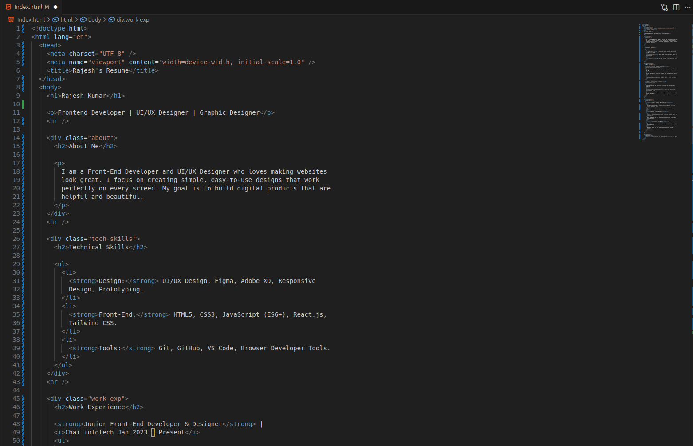
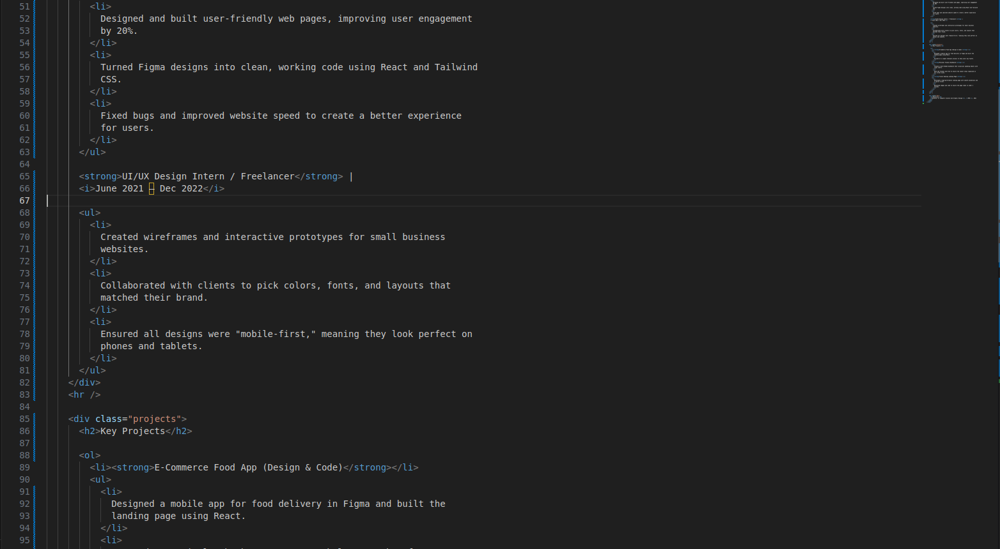
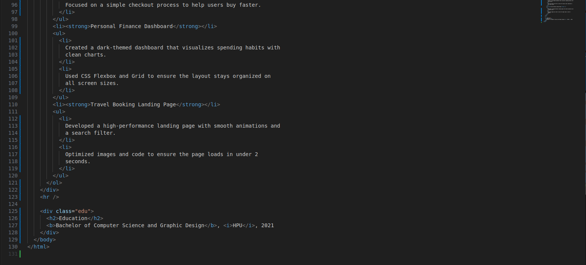
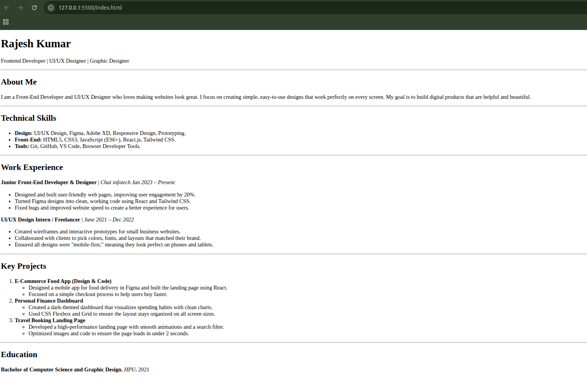

# HTML Resume
A lightweight, semantic, and professionally structured personal resume built entirely with HTML5. 
This project serves as a digital version of my professional profile, highlighting skills in Frontend Development, UI/UX Design, and Graphic Design.

## Purpose
The goal of this project was to create a clean, accessible, and fast-loading resume without the overhead of heavy frameworks, ensuring that the content remains the primary focus for recruiters and automated tracking systems (ATS).

## Project Screenshots

1. The Code Structure





2. The Final Output
This is how the resume looks when you open it in a web browser like Chrome or Edge.




## Project Structure
The code follows a standard HTML5 document flow:

1. Metadata: Defined in the `<head>` for character encoding and mobile responsiveness.

2. Header Section: Introduction with name and professional titles.

3. Body Sections: Detailed breakdowns of professional experience, technical skills, and educational background using semantic tags.

## HTML Tags Used
Here is a breakdown of every HTML element implemented in this `index.html` file:

Document Structure

Tag	Description
```
<!DOCTYPE html>	   Defines the document type as HTML5.
<html lang="en">	 The root element, specifying English as the primary language.
<head>	           Contains metadata, titles, and non-visible document information.
<meta>	           Provides metadata (Charset and Viewport for responsiveness).
<title>	           Sets the browser tab title.
<body>	           Contains all visible content of the webpage.
```

Content & Typography

Tag	Description
```
<h1>	   The main heading (used for the Name).
<h2>	   Sub-headings for distinct sections (About, Skills, Experience, etc.).
<p>	     Standard paragraphs for descriptions and bios.
<hr>	   Horizontal rules used to visually separate sections.
<div>	   Used to group related content together into sections (e.g., .about, .work-exp).
<strong>	Used to give strong importance to specific text (e.g., skill categories).
<b>	     Used for stylistic bolding (e.g., Degree titles).
<i>	     Used for idiomatic text (e.g., Dates and Company names).
```

Lists
```
Tag	Description
<ul>	Unordered list used for bullet points in Skills and Work Experience.
<ol>	Ordered list used to rank or number Key Projects.
<li>	List item used inside both <ul> and <ol>.
```
## How to Run
1. Clone or download the index.html file.

2. Right-click the file and select Open with...

3. Choose your preferred web browser (Chrome, Firefox, Safari, Edge).
